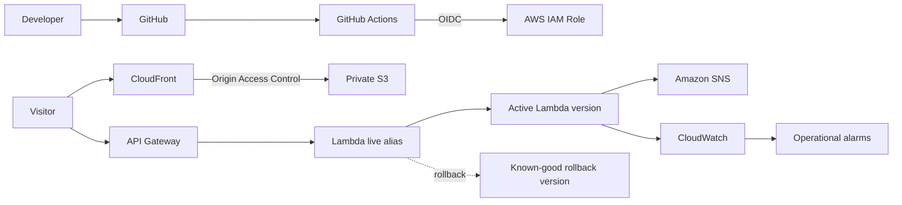

# AWS Serverless Portfolio

> Production AWS portfolio project built with Terraform, serverless AWS services, GitHub Actions OIDC, automated testing, observability, and a tested Lambda rollback workflow.

## Live Site

**Website:** https://d1wnw5kep14m5j.cloudfront.net

What began as a static AWS portfolio evolved into a cloud engineering project focused on infrastructure as code, secure delivery, serverless application design, automated validation, production monitoring, and operational recovery.

## What I Built

The project combines two production paths:

- a private static website delivered through Amazon CloudFront
- a serverless inquiry API built with API Gateway, Lambda, SNS, and CloudWatch

Terraform manages the infrastructure through reusable modules and separate development and production environments. GitHub Actions provides automated testing and deployment using AWS OpenID Connect instead of long-lived AWS credentials.

## Key Engineering Outcomes

- Built reusable Terraform modules with isolated development and production environments.
- Replaced long-lived AWS deployment credentials with GitHub Actions OIDC and temporary AWS credentials.
- Added automated application, infrastructure, production-health, and CI validation coverage.
- Implemented CloudWatch observability, operational alarms, an incident runbook, and a Terraform-controlled Lambda rollback workflow verified with production traffic.

## Architecture



The architecture shows release roles rather than pinning the diagram to one deployment. The rollback section below preserves the exact version 2 -> version 1 -> version 2 production rehearsal history.

## Infrastructure as Code

Terraform is organized into reusable modules and separate environments:

```text
infra/
├── environments/
│   ├── dev/
│   └── prod/
└── modules/
    ├── static-site/
    └── serverless-inquiry/
```

Terraform manages AWS resources across S3, CloudFront, API Gateway, Lambda, SNS, CloudWatch, and IAM.

Development and production use separate Terraform environments, and production uses remote state so infrastructure state is not stored only on a local workstation.

Production changes are reviewed through Terraform plans before they are applied.

## Secure Static Website

The website uses a private S3 bucket rather than a publicly exposed S3 website endpoint.

```text
Visitor
   |
   v
CloudFront
   |
   | Origin Access Control
   v
Private S3 bucket
```

Terraform manages controls including:

- S3 Block Public Access
- bucket policy
- server-side encryption
- S3 versioning
- CloudFront distribution configuration
- CloudFront Origin Access Control

CloudFront provides the public HTTPS delivery layer while direct S3 access remains restricted.

## Serverless Inquiry API

The portfolio inquiry path uses a serverless backend:

```text
Visitor
   |
   v
API Gateway
   |
   v
Lambda live alias
   |
   v
Python Lambda
   |
   v
SNS
```

The Lambda validates incoming inquiry requests before processing them.

Invalid requests return a generic public response, and validation warning logs avoid recording visitor-provided content.

The API also includes configurable throttling and CloudWatch-based operational monitoring.

## CI/CD and Automated Testing

GitHub Actions provides dedicated workflows for authentication, application testing, Terraform testing, production validation, and deployment.

Current workflow coverage includes:

- AWS OIDC authentication testing
- portfolio validation
- AWS deployment
- Python inquiry-handler tests
- Python production-health tests
- Terraform static-site module tests
- Terraform serverless-inquiry module tests
- Terraform production-environment tests

AWS authentication uses GitHub Actions OpenID Connect instead of storing long-lived AWS access keys in the repository.

Application tests include:

```text
tests/test_inquiry_handler.py
tests/test_frontend_inquiry.js
tests/test_aws_production_health.py
```

Terraform tests include:

```text
infra/modules/static-site/tests/basic.tftest.hcl
infra/modules/serverless-inquiry/tests/basic.tftest.hcl
infra/environments/prod/tests/inquiry_disabled.tftest.hcl
```

The testing strategy covers application behavior, infrastructure-module behavior, production configuration, and automated production-health checks.

## Observability and Operations

CloudWatch provides logs, metrics, and alarms for the production inquiry service.

The monitored inquiry signals include:

- API Gateway 4xx responses
- API Gateway 5xx responses
- Lambda errors
- Lambda throttles

Operational alarms use an SNS notification path.

The repository also includes an incident runbook covering application diagnosis, Lambda rollback, Terraform recovery, Terraform state recovery, API Gateway recovery, monitoring recovery, and post-recovery verification.

[View the production incident runbook](docs/inquiry-incident-runbook.md)

## Production-Safe Terraform Workflow

Production infrastructure changes follow a gated workflow instead of being applied directly from an unreviewed local configuration.

```text
Code change
    |
    v
Local tests
    |
    v
Commit + push
    |
    v
Exact-commit CI
    |
    v
Fresh saved Terraform plan
    |
    v
Review exact mutations
    |
    v
Record plan SHA256
    |
    v
Reverify Git, AWS identity, state, routing, and alarms
    |
    v
Apply exact reviewed saved plan
    |
    v
Verify production behavior
    |
    v
Terraform convergence check
```

The reviewed saved plan is treated as the deployment artifact. Applied binary plans are deleted afterward so they cannot accidentally be reused.

## Lambda Versioning and Rollback

The inquiry Lambda uses published immutable versions behind a Terraform-managed `live` alias.

During the documented production rollback rehearsal, routing began as:

```text
API Gateway -> live alias -> Lambda version 2
```

For that rehearsal, Lambda version 1 served as the verified older rollback target.

The explicit Terraform rollback input is:

```text
infra/environments/prod/rollback-v1.tfvars.example
```

The rollback file is intentionally not auto-loaded, so changing the production alias requires explicit operator intent.

## Proven Production Rollback

The rollback design was tested through a controlled production rehearsal rather than left as a theoretical recovery procedure.

The verified lifecycle was:

```text
live -> version 2
        |
        | Terraform rollback
        v
live -> version 1
        |
        | Terraform restoration
        v
live -> version 2
```

Both reviewed Terraform applies were limited to the Lambda alias:

```text
0 added
1 changed
0 destroyed
```

The Lambda package, API Gateway integration, and alias invoke permission remained unchanged during the rollback and restoration.

After each transition, a controlled API request was sent and CloudWatch logs confirmed that production traffic executed on the intended numbered Lambda version.

The rehearsal finished with:

- `live` restored to Lambda version 2
- Lambda version 1 preserved as the rollback target
- all four inquiry alarms healthy
- Terraform reporting `No changes` after restoration

[View the production rollback rehearsal evidence](docs/production-inquiry-lambda-rollback-rehearsal-evidence-2026-08-25.md)

## Production Evidence

Major production changes are accompanied by engineering evidence that records safety gates, reviewed plans, runtime verification, and final convergence.

Selected examples:

- [Lambda version 2 deployment](docs/production-inquiry-lambda-version2-deployment-evidence-2026-08-25.md)
- [Production Lambda rollback rehearsal](docs/production-inquiry-lambda-rollback-rehearsal-evidence-2026-08-25.md)
- [Inquiry observability](docs/production-inquiry-observability-evidence-2026-08-15.md)
- [Inquiry recovery readiness](docs/production-inquiry-recovery-readiness-evidence-2026-08-21.md)
- [Production incident runbook](docs/inquiry-incident-runbook.md)

The detailed evidence remains in `docs/` so the main README can stay focused on the architecture and engineering decisions.

## Repository Structure

```text
.
├── .github/workflows/   # CI/CD and validation workflows
├── infra/               # Terraform environments and reusable modules
├── lambda_src/          # Python inquiry Lambda source
├── scripts/             # Production health automation
├── tests/               # Python and JavaScript tests
├── website/             # Portfolio frontend
├── docs/                # Production evidence and incident runbooks
├── daily-logs/          # Engineering progress records
└── README.md
```

## Technologies

**AWS:** Amazon S3, Amazon CloudFront, Amazon API Gateway, AWS Lambda, Amazon SNS, Amazon CloudWatch, AWS IAM

**Infrastructure and DevOps:** Terraform, GitHub Actions, GitHub OIDC, Git

**Application and Testing:** Python, JavaScript, HTML, CSS, Terraform Test

## What This Project Demonstrates

This project covers the engineering lifecycle around a production AWS system:

```text
Design
  -> Build
  -> Test
  -> Deploy
  -> Observe
  -> Troubleshoot
  -> Recover
  -> Verify
  -> Document
```

The focus is not only on deploying cloud resources, but on making infrastructure reproducible, authentication short-lived, changes reviewable, failures observable, recovery testable, and production state verifiable.
